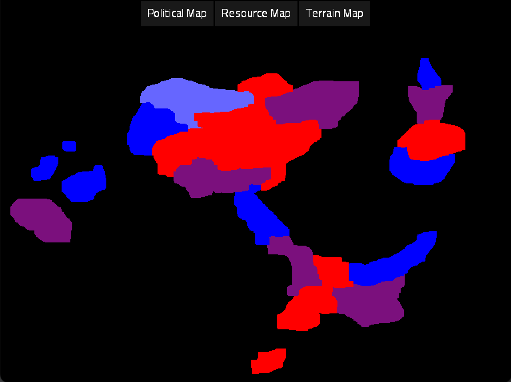
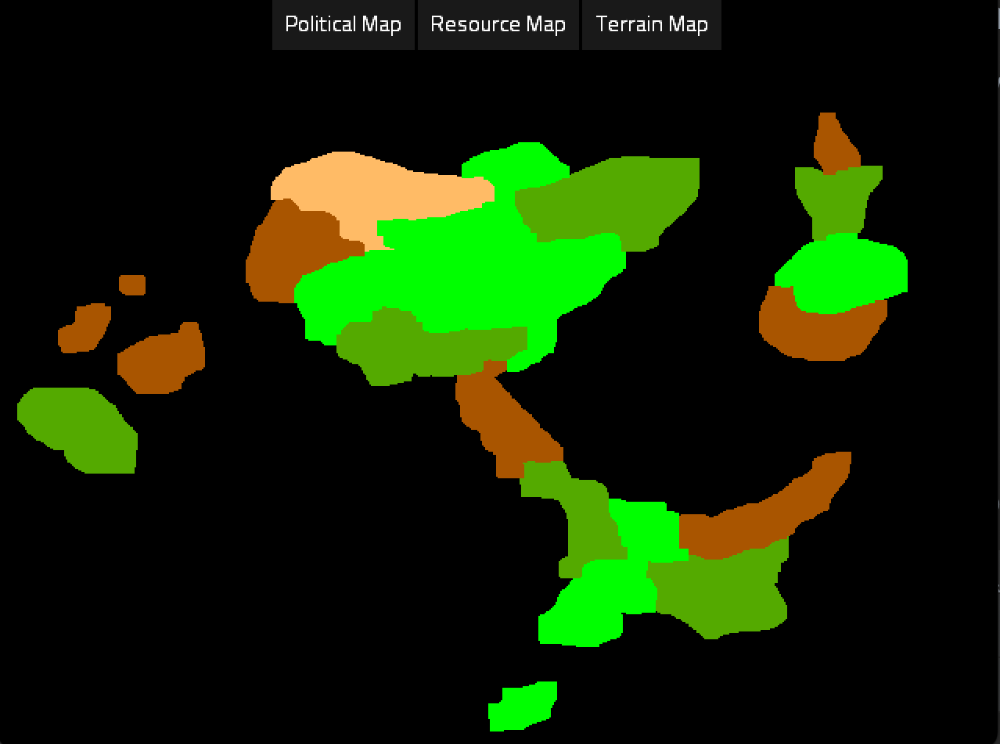
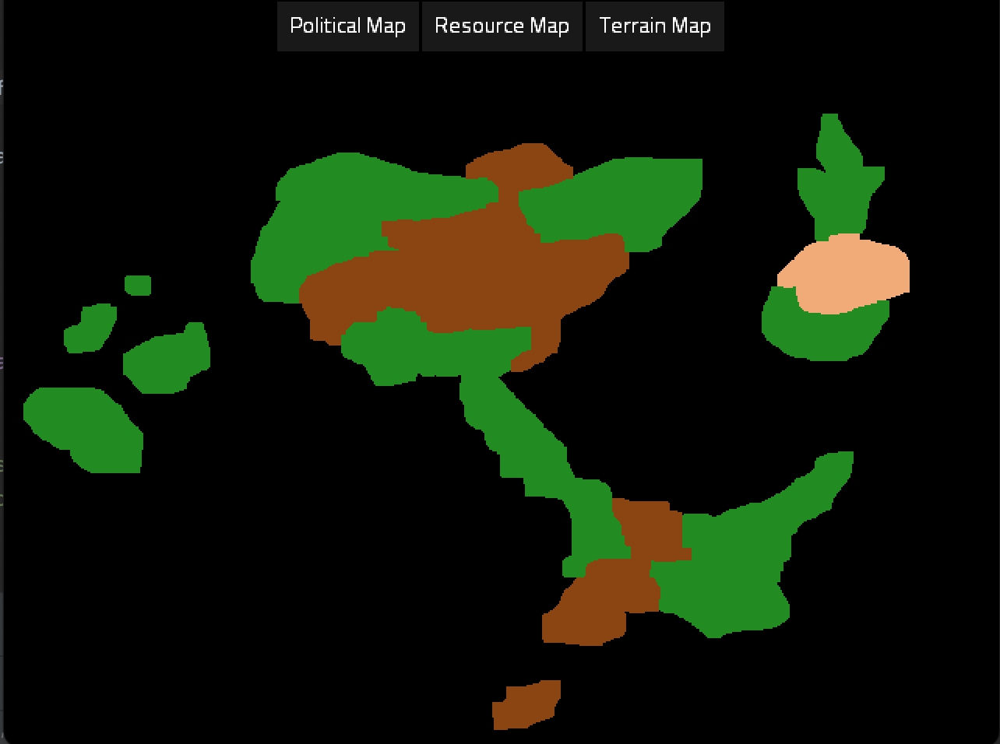

# GdxProvinceMap


[](https://jitpack.io/#boctavian96/GdxProvinceMap)

## Introduction
A simple library for drawing and managing province maps. The library can be integrating on Libgdx.

Here's a sneak peak.

#### Basic political map.


#### Basic Resource map.


#### Basic Terrain map.


## How it works

First we have a image with all the provinces. Each province has unique color.\
Example: \


We can note that we have 3 provinces: red, yellow and blue. 
The engine will parse the image and find the provinces ID. The ID basically is the color of the province in RGB format. \ 

Now in the second phase we need a model file in this case we have an XML format file. \
The model file has the following roles:
- Define a name for the province. Specified by the *\<name\>* tag.
- Terrain type. Specified by the *\<terrainType\>* tag.
- Wealth of the province. Specified by the *\<wealth\>* tag.
- Owner id for the province. This is a important tag because engine will recolour the province to the owner. In our first entry the owner is 1, 0, 0. Which is the RGB color of the owner. In first case RED.
- Province center. Defines a point for the label. *Important: This will be removed in the future and replaced with a simpler/automated version.*

```xml
<map>
    <province id="0">
        <name>West</name>
        <terrainType>Mountains</terrainType>
        <wealth>3000</wealth>
        <ownerId>1,0,0</ownerId>
        <center>22,90</center>
    </province>
    <province id="1">
        <name>Center</name>
        <terrainType>Plains</terrainType>
        <wealth>2000</wealth>
        <ownerId>0,1,0</ownerId>
        <center>40,105</center>

    </province>
    <province id="2">
        <name>East</name>
        <terrainType>Plains</terrainType>
        <wealth>1000</wealth>
        <ownerId>0,0,1</ownerId>
        <center>65,86</center>
    </province>
</map>
```

## Demo
TODO: Make a demo with GWT.  
Note: might have some performance issues on web.

## Use GdxProvinceMap in your project

### Add the dependency
```
maven { url "https://jitpack.io" }
implementation 'com.github.boctavian96:GdxProvinceMap:0.6.57'
```

### Check out the examples
TODO

### How to

#### Create a basic map.
TODO

#### Create a basic model.
```xml
<todo>Document me!</todo>
```

#### Run the class responsible with drawing.

```java
//TODO: Show an example of running the library features.
```
